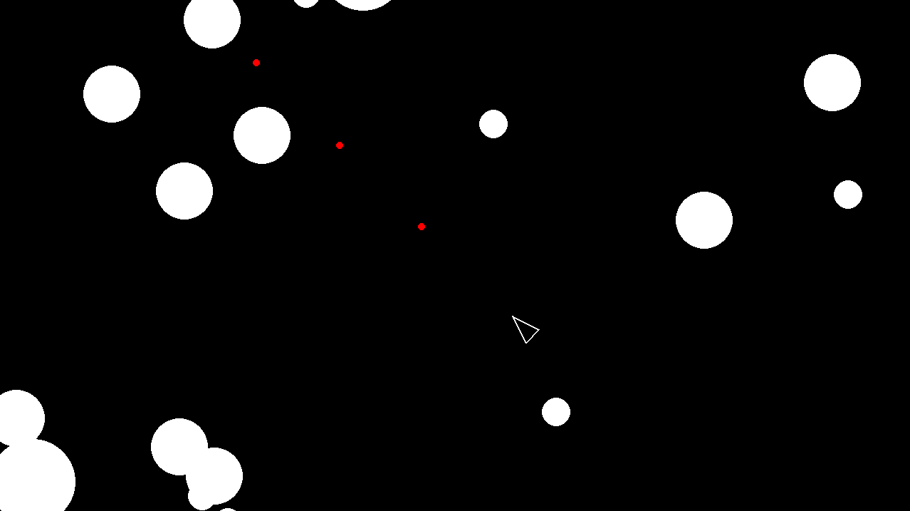

# Asteroids

A small pygame-based Asteroids clone with a player ship, spawning asteroid field, and simple movement/rotation controls. The project is a lightweight learning exercise focused on sprite groups, game loops, and basic physics.

## Controls

- `W` / `S`: move forward/backward
- `A` / `D`: rotate left/right
- `SPACE` : shoot

## Run

```bash
uv run main.py
```